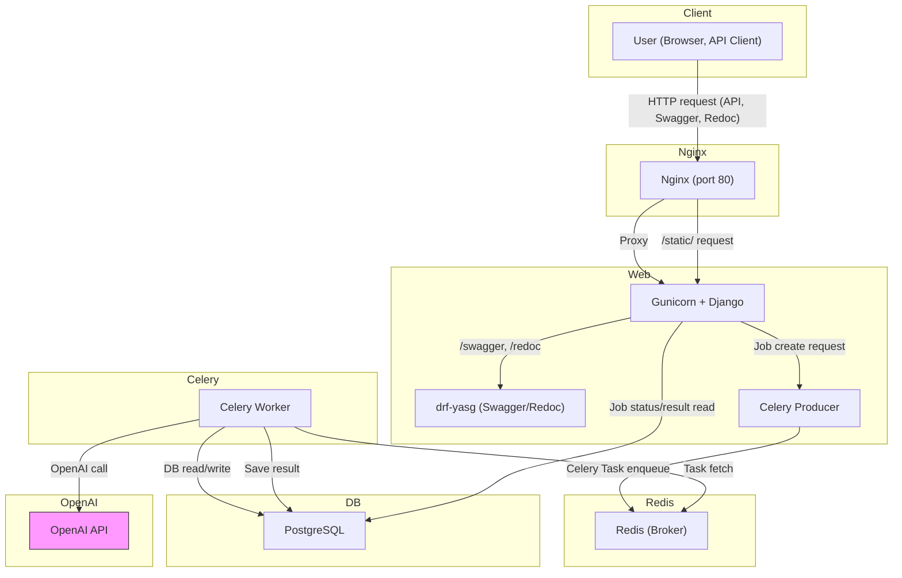

```mermaid
flowchart TD
    subgraph Client
        A1["User (Browser, API Client)"]
    end

    subgraph Nginx
        B1["Nginx (port 80)"]
    end

    subgraph Web
        C1["Gunicorn + Django"]
        C2["drf-yasg (Swagger/Redoc)"]
        C3["Celery Producer"]
    end

    subgraph Celery
        D1["Celery Worker"]
    end

    subgraph Redis
        E1["Redis (Broker)"]
    end

    subgraph DB
        F1["PostgreSQL"]
    end

    subgraph OpenAI
        G1["OpenAI API"]
    end

    %% Flow
    A1 -- "HTTP request (API, Swagger, Redoc)" --> B1
    B1 -- "Proxy" --> C1
    C1 -- "/swagger, /redoc" --> C2
    C1 -- "Job create request" --> C3
    C3 -- "Celery Task enqueue" --> E1
    D1 -- "Task fetch" --> E1
    D1 -- "DB read/write" --> F1
    D1 -- "OpenAI call" --> G1
    D1 -- "Save result" --> F1
    C1 -- "Job status/result read" --> F1

    %% Static files
    B1 -- "/static/ request" --> C1

    classDef ext fill:#f9f,stroke:#333,stroke-width:1px;
    class G1 ext;
```